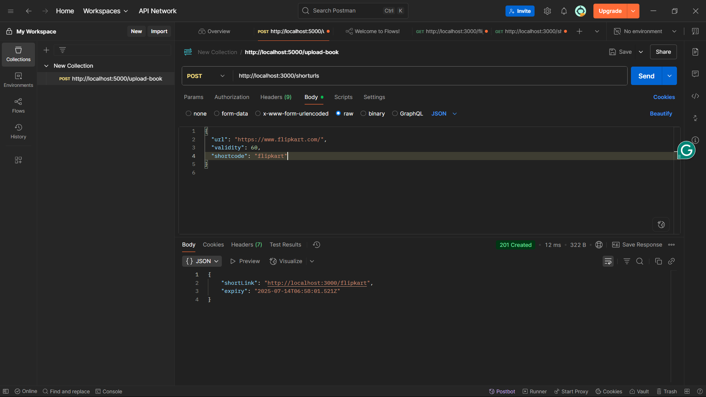
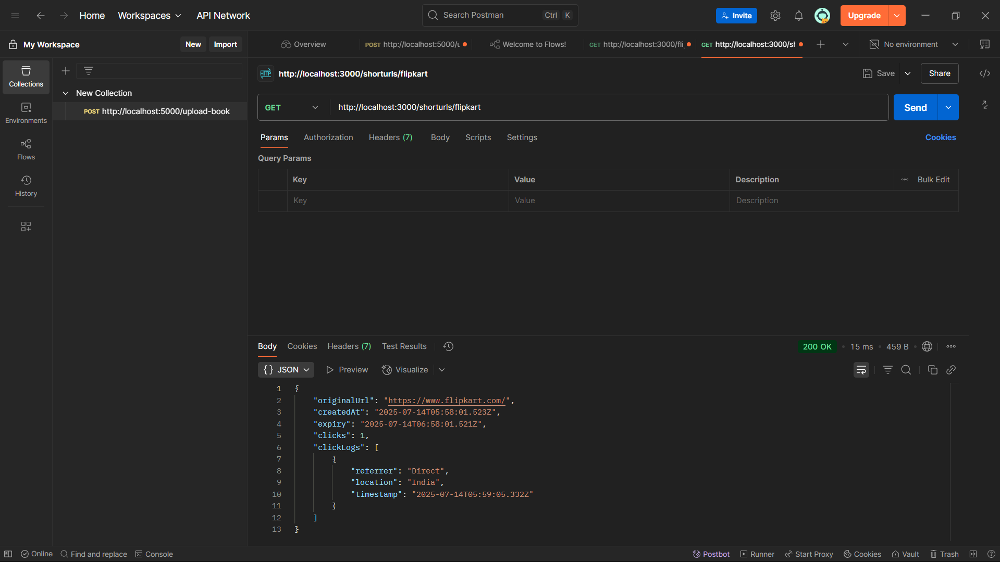
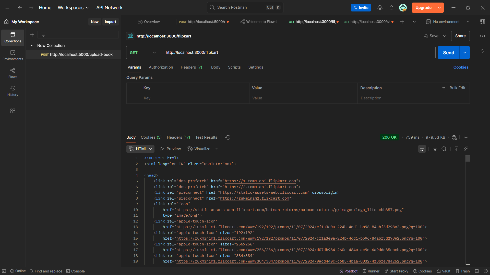

# URL Shortener

## Tech Stack

- Node.js
- Express.js
- MongoDB
- Custom Logging API Integration

## Features

- Shorten long URLs
- Custom shortcodes
- Default & custom expiry
- Redirection
- Stats with click logs
- Remote logging

## How to Run

1. Clone the repo
2. Run `npm install`
3. Create `.env` file
   example:
   PORT=3000
   MONGO_URI=mongodb://localhost:27017/urlshortener
   HOSTNAME=http://localhost:3000
4. Start server with `npm start`

## Screenshots

### Post method

### Get clicklogs method

### Get redirect method

